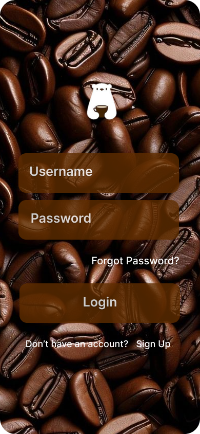
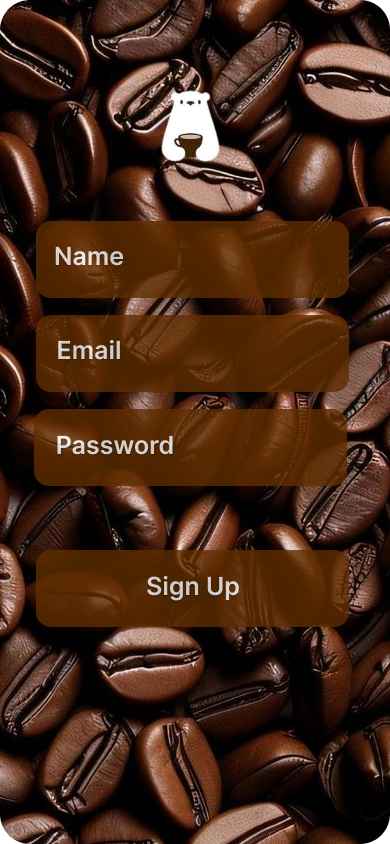
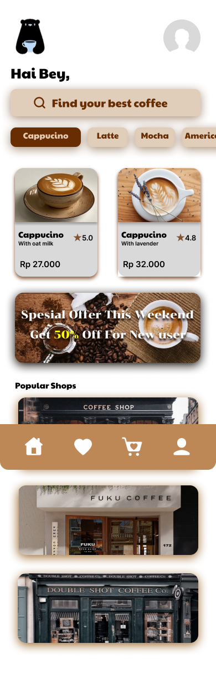
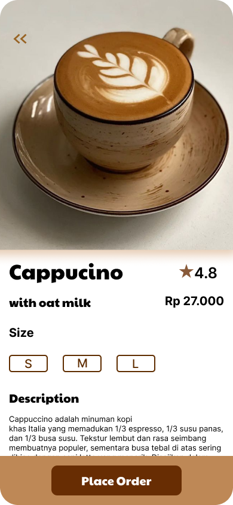
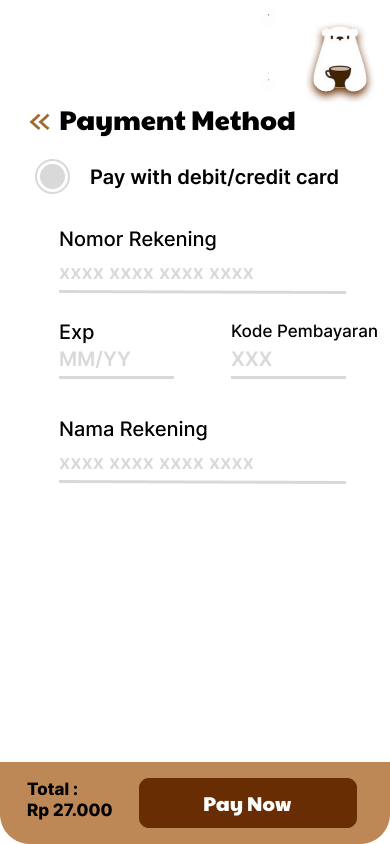
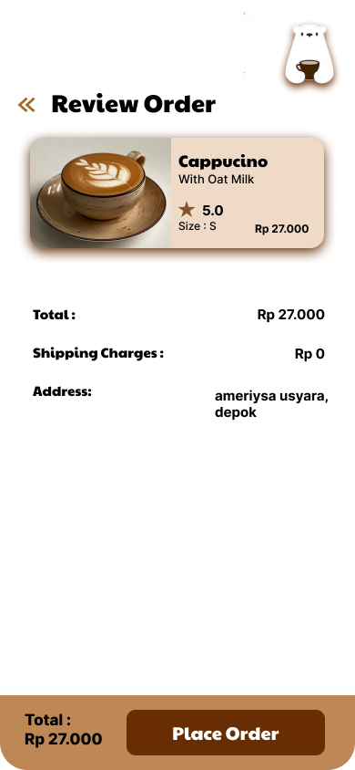

# ☕ Coffee Shop App UI Design

## Preview:

## About
This project is a user interface design for a coffee shop mobile application. 
It focuses on creating a clean, modern, and user-friendly experience for browsing menus, ordering drinks, and exploring coffee products.

## Design Tools
- Figma

## Features
- Modern coffee-themed UI
- Simple and intuitive navigation
- Menu browsing interface
- Product detail layout

## Notes
This project currently focuses on UI design and does not include an interactive prototype yet.